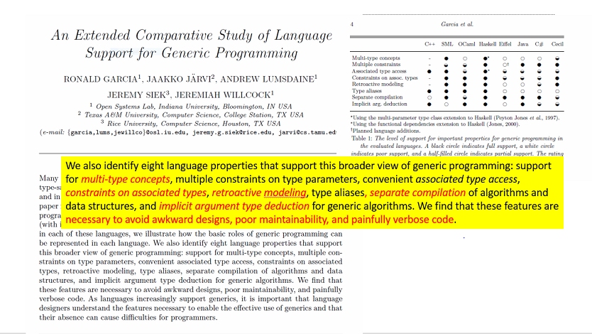
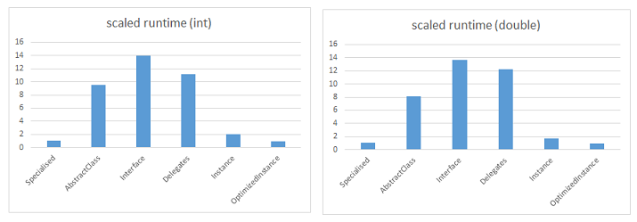
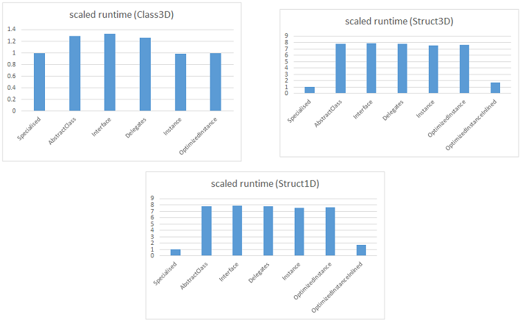

# Classes for the Masses

*(A natural representation for type classes in .NET)*

* Claudio Russo (MSR)
* Matt Windsor (York) (the amazing intern who did most of the hard C# work!)
* Don Syme (MSR) 
* James Clarke (Cambridge) 
* Rupert Horlick (Cambridge)

---

##  Haskell trumps ML! 



--

### **How annoying!** 

---

## Introduction

Type classes are an immensely popular and productive feature of Haskell.

(Almost as good as modules, sometimes better!)

So good, other languages have stolen them:
 * ~~C++ concepts~~ (for perf!)
 * Scala *implicits*
 * Rust *traits* 
 * Swift *protocols*
 * Coq (2 variants),Agda, Clean....

--

But not F# or C#.

--


---
##This talk:

We add type classes to F# using a cheap coding trick that is

* type preserving (no yucky erasure)
* efficient (thanks to .NET's run-time code specialiation)
* essentially free (zero VM modifications required)
* modular

For F#, we call type classes *traits* (Don's preference).

The same technique works interoperably for C# etc. 

*Trait F#* and *Concept C#* are implemented as open source prototypes.

---

##  Recap: Haskell Type Classes

Type classes are an abstraction mechanism for describing generic algorithms.

A *type class* is a predicate on types that specifies a set of required operations by signature.

A *class instance* declares class membership of a type by implementing each operation.

Type classes form hierarchies with *inheritance* and *subsumption*. 

A *generic instance* defines *families* of instances, predicated on class membership.


---


## Why should .NET care?

Instance declarations are decoupled from their types (unlike interfaces).

Type classes can have less overhead than OO abstractions. Even zero overhead.

Type classes allow efficient abstraction over numeric types (sorely missing in .NET).

---

###  ~~"Static Interface Methods for the CLR"~~

.NET team previously proposed and prototyped "Static Interface Methods for the CLR", 
driven by customer demand for *efficient* abstraction over numeric types.

Why didn't this proposal make it?
* It required both runtime & framework changes (too expensive).
* It has soundness issues (too risky).

Our approach:
* requires *no* changes to the runtime or frameworks.
* Is *sound by construction* (due to evidence passing).


---

## Generics Recap

define *Generics*: object oriented lingo for *F-bounded parameteric polymorphism* 

---

## Java/JVM Generics

Java generics are a fiction of the compiler's imagination.

Compiled by "erasing type parameters to their bounds or `object`".

*Erasure Semantics* means the Java VM knows nothing about type parameters, let alone their instantiations .

All instantiations of generic type must have the same least common denominator representation (a heaper pointer).

Because of erasure, Java has to rule out certain (arguably useful!) constructs:

```java
new T()         // illegal Java allocation
new T[100]      // illegal Java array construction
(T) o           // illegal Java cast 
(List<int>) o   // illegal Java cast
List<Int>       // legal, but boxes every entry (fat and slow)
List<int>       // illegal, instantiation not pointer sized 
sizeof(List<Int>) == sizeof(List<Bool)) == sizeof(List<String>) 
```

---

## C#/F#/CLI Generics

In C#, Generics are built into the runtime (through dedicated bytecodes & type information).

Compiled by "passing types at runtime".

*Type Passing* means the CLI VM knows about type parameters and their instantiations at runtime.

The runtime is free to choose different sized representations for different types, even when used as type arguments.

```csharp
new T()         // legal C#
new T[100]      // legal C#
(T)o            // legal C#
(List<int>) o   // legal C#
List<byte>       // legal, note instantiation not pointer sized 
sizeof(List<int>) =/= sizeof(List<bool>) =/= sizeof(List<String>)
// even THIS is ok (though it arguably isn't...)
if (typeof<T> == typeof<int>) 
   Write("I just broke parametericity!");  
```

---

## Code Specialization

Importantly, for performance, the CLR generates specialised code for particular instantiations (Kennedy & Syme, 2001)

Types comes in two flavours:
* *value types* (scalar primitives & user defined structures). 
   Cheaply stack-allocated, passed by value.
* *reference types* (objects & arrays). 
   Expensively heap-allocated, passed by reference.

Type parameters range over/can be instantiated with both flavours.

Code instantiated at *reference* (ie. heap) types (`object`,`string`, `int[]`) is *shared* between all reference type instantiations (with some indirection
for type specific operations) (to avoid code bloat).

Code instantiated at *value* types (`int16`, `int32`, `point`) is *specialized* for each instantiation.

Code instantiated at mixtures of reference and non-reference types is "partially" specialized (it's complicated).

---

## Benefits of Specialization

Specialization  typically happens *just-in-time* (i.e. at runtime, at first instantiation). 

Specialization replaces statically unknown representation sizes by dynamically known ones.

Like static inlining, type specialization can turn indirect calls (to *unknown* functions) into faster, direct calls to *known* functions. 

Futhermore, *known* functions can be *inlined*, removing function call overhead altogether and exposing more optimizations.

(An on-demand version of C++'s compile time specialization.)
---


---
##  Haskell Type Classes
 
We represent a Haskell type class, e.g.

```Haskell
  class Eq a where 
    (==) :: a -> a -> Bool
```

as a *generic* F# interface:
```fsharp
type Eq<'A> = 
    abstract equal: 'A -> 'A -> bool 
```

Trait F#
```fsharp
[<Trait>]
type Eq<'A> = 
    abstract equal: 'A -> 'A -> bool 
```

---

## Haskell Overloads

The Haskell declaration of class `Eq a` implicitly declares the overload:

```Haskell
    (==) :: (Eq a) => a -> a -> Bool  -- note the added constraint!
```

In F#, an overload  can be encoded as a generic function, parameterized by an additional type parameter `'EqA`.

```fsharp
 let equal<'A,'EqA when 'EqA : struct and 'EqA :> Eq<'A>> a b =
       defaultof<'EqA>.equal a b
```

The ordinary type parameter `'EqA` is:
* constrained to be a `struct` (allocable on the stack); 
* bounded by its interface (`'EqA: Eq<'A>`);
* a named *witness* for the constraint `Eq<'A>`.

(think `equal`: `forall 'A, 'EqA <: Eq<'A>. 'A -> 'A -> bool`)


> *Haskell dictionary value ~ F# witness type*

---

## Zooming in

Look closely:

```fsharp
 let equal<'A,'EqA when 'EqA : struct and 'EqA :> Eq<'A>> a b =
       defaultof<'EqA>.equal a b
```

Where is the *value* parameter for the "dictionary" that GHC would insert?

--

We don't need one!

In F#, primitive `defaultof<T>` has type `T` and returns a default value.

Using `defaultof<T>`, we can create dictionary values on demand, when required for calls.

Doing so explicitly is gross, so in Trait F#, we extend the dot notation to access overloads:

```fsharp
 let equal a b = Eq.equal a b // dot notation for trait members
                              // introduces constraints 
```

(The `struct` constraints ensure dictionary values are never 'null'; no call can fail.)

---


## Haskell Instances

A Haskell ground instance, eg.

```Haskell
  instance Eq Integer where 
    x == y                =  x `integerEq` y
```

is translated to an F# *struct* implementing a trait (i.e. interface).
 
```fsharp
[<Struct>]
type EqInt = 
      interface Eq<int> with 
        member this.equal a b = a = b
...
```

The struct is empty (think `unit`) but (!) has associated code.

Trait F#:
```fsharp
[<Witness>] // a.k.a instance
type EqInt = 
     interface Eq<int> with 
       member equal a b = a = b // no 'this.'
...
```
---


##  Generic Instances...

Haskells generic instances define *families* of instances.

E.g. 

Given an equality type `a`, we can define an equality
on *lists* of `a` (written `[a]`):

```Haskell
  instance (Eq a) => Eq [a] where 
       nil == nil      = true
    (a:as) == (b:bs)   = (a == b) && (as == bs)
         _ == _        = false
```

---

## ...Generic Instances

We can represent a Haskell *parameterized instance* as a *generic struct*, 
implementing an interface but parameterized by suitably constrained type parameters. 

```fsharp
[<Struct>]
type EqList<'A,'EqA when 'EqA : struct and 'EqA :> Eq<'A>> = 
    interface Eq<'A list> with
      member this.equal a b =  // this unused
          match a,b with
          | a::l,b::m -> equal<'A,'EqA> a b && // type args reqd!
                         equal<'A list,EqList<'A,'EqA>> l m
          | [],[] -> true | _ ,_ -> false
```

Trait F#:
```fsharp
[<Witness>]
type EqList<'A,'EqA when 'EqA :> Eq<'A>> = // 'EqA:struct implicit
    interface Eq<'A list> with
      member equal a b = 
          match a,b with
          | a::l,b::m -> equal a b && equal l m
          | [],[] -> true | _ ,_ -> false
```

---

## Constructing Evidence

Derived instances allow Haskell to automatically construct instances as evidence for constraints:

```Haskell
  --- Since Eq Integer and Eq a => Eq (List a),
  --- we have Eq (List Integer) hence Eq (List (List Integer))
   
   [[1],[2,2],[3,3,3]] == [[3,3,3],[2,2],[1]]  -- typechecks!
```

In F# `EqInt:>Eq<int>` so `EqList<int,EqInt> :> Eq<int list>` so `EqList<int list,EqList<int,EqInt>> :> Eq<int list list>`.

In F#, dictionary type arguments cannot be inferred... they usually don't occur elsewhere in the type!

```fsharp
   equal [[1];[2;2];[3;3;3]] [[3;3;3];[2;2];[1]] // type error

   equal<int list list,EqList<int list,EqList<int,EqInt>>> 
   	 [[1];[2;2];[3;3;3]] [[3;3;3];[2;2];[1]] // works
```

Programming in the encoding requires explicit type abstraction and instantiation.

---

## Instance Inference

No programmer should write this crap!

In Trait F#, we extend inference so witness type arguments are derived from the trait hierarchy.

Trait F#:
```fsharp
   equal [[1];[2;2];[3;3;3]] [[3;3;3];[2;2];[1]] // type checks! 
```

Witness are inferred using type driven backchaining, similar to Haskell.

This is an extension of F#'s existing type constraint solver (Don's the man).

---


##  Derived Operations 

We translate Haskell's qualified types as extra, bounded type parameters denoting witness parameters.

For example, equality based list membership in Haskell is defined as follows:

```Haskell
  elem :: Eq a => a -> [a] -> bool
  x `elem`  []            = False
  x `elem` (y:ys)         = x==y || (x `elem` ys)  
``` 

In F#, we can encode this as:
```fsharp
let rec elem<'A,'EqA when 'EqA:struct and 'EqA:>Eq<'A>> x ys =
    match ys with
    | [] -> false
    | y::ys -> equal<'A,'EqA> x y && elem x ys
```

Trait F#:
```fsharp
let rec elem x ys =
    match ys with
    | [] -> false
    | y::ys -> equal x y && elem x ys
```

---


##  Type Class Inheritance

Haskell supports (multiple) inheritance of super classes.

```Haskell
  class (Eq a) => Num a where
    Add: a -> a -> a
    Mult: a -> a -> a
    Neg: a -> a
```

* Forall types `a`, `Num a` derives from `Eq a`. 

In F#, we instead use ordinary (multiple) interface inheritance:
```fsharp
type Num<'A> = 
    inherit Eq<'A>
    abstract add: 'A -> 'A ->'A
    abstract mult: 'A -> 'A ->'A
    abstract neg: 'A -> 'A

type NumInt = 
    interface Num<int> with
      member this.equal a b = equal<int,EqInt> a b // named instance!
      member this.add a b = a + b
      member this.mult a b  = a + b
      member this.neg a = -a 
```

---

## ... Inheritance

Trait F#:
```fsharp
[<Trait>]
type Num<'A> = 
    inherit Eq<'A>
    abstract add: 'A -> 'A ->'A
    abstract mult: 'A -> 'A ->'A
    abstract neg: 'A -> 'A

[<Witness>]
type NumInt = 
    interface Num<int> with
      member equal a b = equal<_,EqInt> a b 
      member add a b = a + b
      member mult a b  = a + b
      member neg a = -a 
```

* Haskell class inheritance ~ F# interface inheritance 

---
##  Subsumption ...
Subsumption derives (evidence for) a class from (evidence for) its subclasses.

```Haskell
    equals :: (Eq a) => a -> a -> Bool

    square :: (Num a) => a -> a 
    square a = a * a

    memsq :: (Num a) => [a] -> a -> Bool
    memsq nil a = false
    memsq (h:t) a =     equals h (square a) 
                     -- ^^^^ legal coz Num a |= Eq a 
                     || memsq h t
```
---

##  ... Subsumption

F#:
```fsharp
let square<'A,'NumA when 'NumA:struct and 'NumA:>Num<'A>> x =
     defaultof<'NumA>.mult x x

let rec memsq<'A,'NumA when 'NumA:struct and 'NumA:>Num<'A>> n a = 
      match n with
      | [] -> false
      | (h::t) -> equal<'A,'NumA> h (square<'A,'NumA> a)
                // ^^^^ legal coz 'NumA :> Num<'A> :> Eq<'A> 
                || memsq<'A,'NumA> n a
```
Trait F#:
```fsharp
let square x = Num.mult x x

let rec memsq n a = 
    match n with
    | [] -> false
    | (h::t) -> equal h (square a) || memsq n a
```


---

## MSIL ByteCode

```fsharp
 let equal<'A,'EqA when 'EqA : struct and 'EqA :> Eq<'A>> a b =
       defaultof<'EqA>.equal a b
```

Compiles to (something like) CIL generic bytecode:

```c
.method public static bool equal<A, 
                                 struct .ctor(class Eq<!!A>) EqA> 
   (!!A a,!!A b) 
   cil managed {
   .locals init ([0] !!EqA loc1)
   ldloca.s loc1      // stack allocate dictionary
   initobj !!EqA      // initialize (empty) dictionary
   ldloca.s loc1      // load address of dictionary onto stack
   ldarg.0            // load argument 1   
   ldarg.1            // load argument 2
   constrained. !!EqA // pseudo virtual call through dictionary
   callvirt instance bool class Eq<!!A>::equals(!0, !0) 
   ret
}
```
The `callvirt` instruction is typically used for an indirect call to a virtual method.

When actual type `EqA` is a struct, due to specialization, the callee is always known and often inlined.

---


### Performance

Evaluating a polynomial `f(x:T) = x*x + x + (T)666` (in C#), 

where `T`=`int`, `double`, `Class3D`, `Struct3D`.

(We evaluate `f(x)` at `1m` values of `x` using the BenchmarkDotNet harness.)

```csharp
    T ConceptGenericOpt<T, NumT>() where NumT : struct, Num<T> {
       NumT NI = default(NumT);
       T y = NI.FromInteger(0);
       T c = NI.FromInteger(666);
       for (int i = 0; i < n; i++) {
          T x = NI.FromInteger(i);
          y = NI.Plus(NI.Plus(NI.Mult(x,x),x), c);
       }
       return y;
    }
```
Comparisons:
+ Baseline: non generic, hand-specialized  code (one per T)
+ AbstractClass: generic class based (OOP style)
+ Interface: generic interface based (OOP style)
+ Delegate: generic, firt-class function based (OOP/FP style)
+ Instance: trait based (one dictionary value per call)
+ OptimizedInstance: optimized trait based (CSE on dictionaries) (shown above)

---
###  Relative Performance at Scalar types



At primitive value type instantiations, trait performance is:
* as good as hand specialised code, 
* at least *8-14x faster* than standard OO abstractions.

---
### Relative Performance at Compound Types




At 3 field class and struct instantiations, performance can be competive with hand specialised code, 
1.4-8x faster than OO abstractions (if we are careful to inline).

---

##x86  (DEBUG)

This, in  outline, is the x86 code jitted at `NumInt:Num<int>`:
The real code is 64 lines of suboptimal masm (yuck).


```masm
    696:             NumT NI = default(NumT);
    01140628  lea         eax,[ebp-10h]  
    0114062B  mov         byte ptr [eax],0  
    697:             T y = NI.FromInteger(0);
... 01140633  call        dword ptr ds:[0C65E78h]   ...
    698:             T c = NI.FromInteger(666);
... 0114064A  call        dword ptr ds:[0C65E78h]   ...  
    699:             for (int i = 0; i < n; i++) {
    700:                 T x = NI.FromInteger(i);
... 01140668  call        dword ptr ds:[0C65E78h]  ...
    701:                 y = NI.Plus(NI.Plus(NI.Mult(x,x),x), c);
... 0114068C  call        dword ptr ds:[0C65E8Ch]  ... 
... 0114069E  call        dword ptr ds:[0C65EA0h]  ...  
... 011406B0  call        dword ptr ds:[0C65EA0h]  ...
    702:             }
    703:             return y;
    704:         }
    011406E4  mov         eax,dword ptr [ebp-28h]  ... 
... 011406ED  ret  
```

Notice this still has 4 *call* instructions in the inner loop - the cost of abstraction!

Luckily, the *optimizing* JIT does *much* better ...
---


##x86 (RELEASE) 

This is the optimised code jitted at `NumInt:Num<int>`.

```masm
   696:             NumT NI = default(NumT);
00007FFD8BF85110  sub         rsp,8  
00007FFD8BF85114  xor         eax,eax  
00007FFD8BF85116  mov         qword ptr [rsp],rax  
00007FFD8BF8511A  mov         byte ptr [rsp],0  
00007FFD8BF8511E  xor         eax,eax  
   699:             for (int i = 0; i < n; i++) {
00007FFD8BF85120  xor         edx,edx  
00007FFD8BF85122  mov         ecx,dword ptr [7FFD8BFC3B38h]  
00007FFD8BF85128  test        ecx,ecx  
00007FFD8BF8512A  jle         00007FFD8BF8513E  
00007FFD8BF8512C  mov         eax,edx  
00007FFD8BF8512E  imul        eax,edx  
00007FFD8BF85131  add         eax,edx  
00007FFD8BF85133  add         eax,29Ah  
00007FFD8BF85138  inc         edx  
00007FFD8BF8513A  cmp         edx,ecx  
00007FFD8BF8513C  jl          00007FFD8BF8512C  
00007FFD8BF8513E  add         rsp,8  
00007FFD8BF85142  ret  
```

Notice this is straight-up arithmetic code! Just 18 lines of masm (was 64 lines)

*No* function calls/stack manipulation remain! *Way faster*.
---


## Concept CSharp (Matt Windsor)

Unlike F#, our more rounded C# implementation adds dedicated keywords, Haskell-style defaulting
and full support for numeric operator syntax, e.g.:
```csharp
concept Eq<A> {
    bool Equal(A a, A b);
}
static class Overloads {
    public static bool Eq<A, implicit EqA>(A a, A b)
		 where EqA : Eq<A> => 
       Equals(a, b);
}
instance EqInt : Eq<int> {
    bool Equal(int a, int b) => a == b;
}
instance EqList<A, implicit EqA> : Eq<List<A>> where EqA : Eq<A> {
     public bool Equal(List<A> a, List<A> b)  =>
          (a.IsNull && b.IsNull)
       || (a.IsCons && b.IsCons 
           && default(EqA).Equal(a.Head,b.Head) 
           && Equal(a.Tail,b.Tail)); 
}
```
In Concept C#, Witness inference is a mild extension of (concept-drived) type argument inference.

---

## Proposed Case Studies (In Progress)

* Micro-benchmarks for perf (sorting & arithmetic)
* Automatic Differentiation in C#/F#, overloading arithmetic to compute function derivatives [1]
* C# , F# renditions of Haskell Prelude, including numeric tower
* C# Generic QuickHull (one convex hull algorithm for generic vector spaces)

Future:

* C# Generic Graph Library - Haskell used to trump C#, does it still?
* Pickling
* Normalization by Evaluation
* ... any suggestions?

[1]["Conal Elliot, Beautiful Differentiation"]

---

## Summary 

-----------------------------
| Haskell | .NET | Trait F# |
|----------|--------|---------|
|type class | generic interface| trait |
|instance| (named) struct  | (named) witness |
|derived instance | generic struct | generic witness |
|inheritance	| interface inheritance | trait inheritance|
|overload | generic method | generic function|
|implicit dictionary passing | explicit type passing | implicit type passing |
|constraint solving | constraint checking | constraint solving |
|constraint propagation | NA | constraint propagation |
-------------------------------------------------------

---

## Take Home
* Haskell 98's type classes have a type preserving .NET representation.
* Dictionaries can be manually constructed and provided or, better, inferred.
* Generated code is efficient:
    * Dictionaries are empty (stack-allocated) structs. 
    * Dictionary allocation has zero runtime cost.
    * CLR's code specialization ensures all dictionary calls are direct calls at runtime. Many are in-lined.
---

## Future work:

* Exploit variance in interfaces (no Haskell analog).
* Dedicated F# syntax.
* Associated Types/Poor Man's Modules
* JIT/Compiler comptimizations (sharing dictionary values, hoisting stack initialization out of loops).
* tech transfer (hearts and minds)
* Justified, Pluggable Types

---

##  Links & References

F# fork: https://github.com/CaptainHayashi/visualfsharp/tree/hackathon-vs

C# version of this document https://github.com/CaptainHayashi/roslyn/blob/master/concepts/docs/concepts.md.

Roslyn C# fork: https://github.com/CaptainHayashi/roslyn.

Roslyn https://github.com/dotnet/roslyn.

D. Gregor, J. Jarvi, J. Siek, B. Stroustrup, G. Dos Reis, and A. Lumsdaine. *Concepts: Linguistic support for generic programming in C++*, OOPSLA'06.

A. Kennedy and D. Syme. Design and implementation of generics for the .net common language
  runtime, PLDI 2001.

B. C. Oliveira, A. Moors, and M. Odersky. *Type classes as objects and implicits*, OOPSLA '10.

S. Peyton Jones. *Haskell 98 language and libraries : the revised report*. Cambridge University Press, May 2003.

P. Wadler and S. Blott. *How to make ad-hoc polymorphism less ad hoc*. POPL '89

D. Yu, A. Kennedy, and D. Syme. *Formalization of generics for the .net common language runtime.*, POPL 2004.


